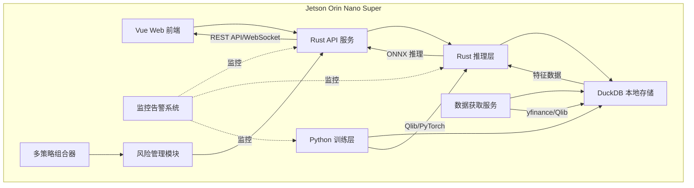

# 技术架构

## 1. 技术选型

### 1.1 技术栈总览

| 层级 | 技术栈 | 选型理由 |
|------|--------|----------|
| 前端 | Vue 3 + TypeScript + Vite | 现代化 Web 界面,轻量级,适配本地静态文件服务 |
| 接口层 | Rust (Axum) | 高性能、内存安全的 API 服务,适合 Jetson 资源受限环境 |
| 推理层 | Rust (ort) | ONNX 模型推理,支持 CUDA 加速,高效利用 Jetson GPU |
| 训练层 | Python (Qlib + PyTorch) | 成熟的量化交易框架,丰富的金融 ML 算法支持 |
| 数据库 | DuckDB | 嵌入式时序数据库,零配置,列式存储优化金融数据 |
| 数据源 | yfinance (美股) + Qlib 内置 CN 数据 (A 股) | 免费开源数据源,支持代理配置 |
| 部署方案 | 本地部署为主,Docker 可选 | 满足自行部署需求,同时提供容器化选项 |

### 1.2 技术选型理由

#### 1.2.1 为什么选择 Rust

- **内存安全**: 编译时保证内存安全,避免运行时崩溃
- **高性能**: 接近 C/C++ 的性能,无 GC 开销
- **并发安全**: 所有权系统保证线程安全
- **资源占用低**: 适合 Jetson 资源受限环境
- **生态成熟**: Axum、ort 等库成熟稳定

#### 1.2.2 为什么选择 Python + Qlib

- **Qlib 优势**: 微软开源的量化交易框架,专为金融场景设计
- **丰富的算法**: 内置多种因子和模型
- **数据处理**: 强大的特征工程能力
- **生态完善**: PyTorch、NumPy、Pandas 等库支持
- **快速迭代**: 适合策略研发和实验

#### 1.2.3 为什么选择 DuckDB

- **嵌入式**: 无需独立服务,零配置
- **列式存储**: 优化时序数据查询性能
- **SQL 支持**: 标准 SQL 语法,易于使用
- **高性能**: 针对分析型查询优化
- **轻量级**: 适合边缘设备部署

#### 1.2.4 为什么选择 ONNX

- **跨平台**: Python 训练,Rust 推理
- **标准化**: 工业标准模型格式
- **优化**: 支持各种硬件加速
- **兼容性**: 主流框架都支持导出

## 2. 系统架构

### 2.1 整体架构图



### 2.2 分层架构

#### 2.2.1 展示层 (Presentation Layer)

- **技术**: Vue 3 + TypeScript
- **职责**:
  - 用户界面展示
  - 实时数据可视化
  - 用户交互处理
  - 图表和报表展示

#### 2.2.2 接口层 (API Layer)

- **技术**: Rust + Axum
- **职责**:
  - RESTful API 服务
  - WebSocket 实时推送
  - 请求路由和验证
  - 业务逻辑编排

#### 2.2.3 业务层 (Business Layer)

- **推理服务**: 模型推理和信号生成
- **风险管理**: 风险计算和控制
- **策略管理**: 多策略组合和权重分配
- **交易执行**: 订单管理和执行
- **监控告警**: 系统监控和告警

#### 2.2.4 数据层 (Data Layer)

- **数据获取**: 市场数据和新闻数据采集
- **数据存储**: DuckDB 时序数据存储
- **数据处理**: 特征工程和数据清洗

#### 2.2.5 训练层 (Training Layer)

- **技术**: Python + Qlib + PyTorch
- **职责**:
  - 模型训练
  - 特征工程
  - 回测验证
  - 模型导出

## 3. 核心模块设计

### 3.1 数据获取模块

- 支持多数据源(yfinance、Qlib)
- 自动数据更新
- 数据质量验证
- 异常处理和重试

### 3.2 特征工程模块

- 技术指标计算
- 因子构建
- 数据标准化
- 特征选择

### 3.3 模型训练模块

- GRU/LSTM 时序模型
- 模型训练和验证
- 超参数优化
- ONNX 模型导出

### 3.4 推理服务模块

- ONNX Runtime 推理
- GPU 加速
- 批量推理
- 结果缓存

### 3.5 风险管理模块

- VaR 计算
- 头寸管理
- 回撤监控
- 风险预警

### 3.6 交易执行模块

- 订单生成
- 订单拆分
- 成交确认
- 执行容错

### 3.7 监控告警模块

- 系统监控
- 性能监控
- 风险监控
- 多级告警

### 3.8 回测框架模块

- 历史数据回测
- 成本模拟
- 绩效评估
- 报告生成

## 4. 数据流设计

### 4.1 训练数据流

```
数据源 → 数据获取 → 数据清洗 → 特征工程 → 模型训练 → ONNX 导出
```

### 4.2 推理数据流

```
实时行情 → 特征计算 → 模型推理 → 信号生成 → 风险评估 → 交易执行
```

### 4.3 监控数据流

```
系统指标 → 数据采集 → 异常检测 → 告警判断 → 通知发送
```

## 5. 接口设计

### 5.1 RESTful API

- `/api/market/data` - 获取市场数据
- `/api/strategy/list` - 获取策略列表
- `/api/strategy/backtest` - 执行回测
- `/api/portfolio/positions` - 获取持仓
- `/api/risk/metrics` - 获取风险指标
- `/api/orders/submit` - 提交订单
- `/api/alerts/list` - 获取告警列表

### 5.2 WebSocket

- `/ws/market` - 实时行情推送
- `/ws/signals` - 交易信号推送
- `/ws/alerts` - 告警实时推送
- `/ws/metrics` - 性能指标推送

## 6. 部署架构

### 6.1 本地部署

- Rust 服务作为系统服务运行
- Vue 前端作为静态文件直接访问
- DuckDB 直接文件存储
- 无容器依赖

### 6.2 Docker 部署(可选)

- 多阶段构建
- Docker Compose 编排
- 数据卷持久化
- ARM64 原生支持
