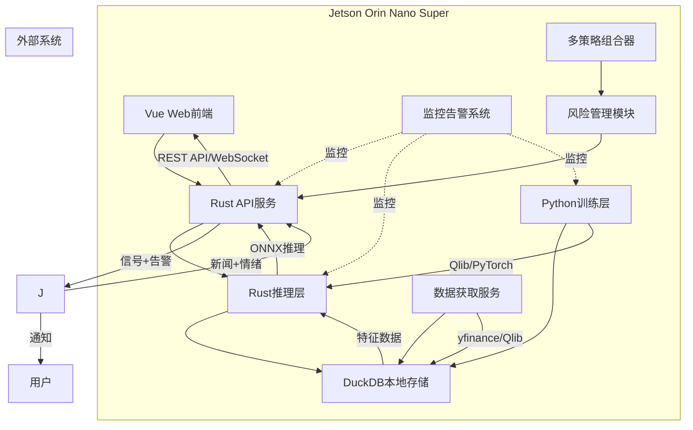

# 技术架构

## 1. 技术选型

| 层级 | 技术栈 | 选型理由 |
|------|--------|----------|
| 前端 | Vue 3 + TypeScript + Vite | 现代化Web界面，轻量级 |
| 接口层 | Rust (Axum) | 高性能、内存安全，适合资源受限环境 |
| 推理层 | Rust (ort) | ONNX推理，CUDA加速，高效利用GPU |
| 训练层 | Python (Qlib + PyTorch) | 成熟量化框架，丰富金融算法 |
| 数据库 | DuckDB | 嵌入式，零配置，列式存储 |
| 数据源 | yfinance + Qlib | 免费开源，支持A股/美股 |
| 部署 | 本地部署 + Docker可选 | 灵活部署方案 |

## 2. 系统架构



### 2.1 分层架构

| 层级 | 技术 | 职责 |
|------|------|------|
| **展示层** | Vue 3 + TypeScript | UI展示、数据可视化、用户交互 |
| **接口层** | Rust + Axum | REST API、WebSocket、路由验证 |
| **业务层** | Rust | 推理服务、风险管理、策略管理、信号生成、监控告警 |
| **数据层** | DuckDB | 数据获取、存储、处理 |
| **训练层** | Python + Qlib | 模型训练、特征工程、回测、导出 |

### 2.2 外部集成层

| 组件 | 职责 |
|------|------|
| **新闻接收器** | 接收新闻数据和情绪分析结果 |

## 3. 核心模块

| 模块 | 核心功能 |
|------|---------|
| **数据获取** | 多数据源、自动更新、质量验证、异常重试 |
| **特征工程** | 技术指标、因子构建、标准化、特征选择 |
| **模型训练** | GRU模型、训练验证、超参优化、ONNX导出 |
| **推理服务** | ONNX Runtime、GPU加速、批量推理、缓存 |
| **信号生成** | 预测结果转换、置信度计算、建议格式化 |
| **风险管理** | VaR计算、仓位建议、回撤监控、风险预警 |
| **成本估算** | 佣金计算、滑点估算、流动性分析、执行建议 |
| **监控告警** | 系统/性能/风险监控、多级告警、价格触发告警 |
| **回测框架** | 历史回测、成本模拟、绩效评估、报告生成 |

## 4. 数据流

**训练流程**：数据源 → 获取 → 清洗 → 特征工程 → 训练 → ONNX导出

**推理流程**：实时行情 → 特征计算 → 推理 → 信号生成 → 风险评估 → 建议输出

**监控流程**：系统指标 → 采集 → 异常检测 → 告警判断 → 通知发送


## 5. API接口

**REST API**：

- `/api/market/data` - 市场数据
- `/api/strategy/backtest` - 回测
- `/api/portfolio/positions` - 持仓
- `/api/risk/metrics` - 风险指标
- `/api/signals/latest` - 最新建议
- `/api/alerts/trigger` - 触发告警

**WebSocket**：

- `/ws/market` - 实时行情
- `/ws/signals` - 交易建议
- `/ws/alerts` - 告警推送

## 6. 信号输出格式

系统输出**投资建议**而非自动执行交易：

```json
{
  "signal_id": "uuid",
  "timestamp": "2024-01-15T14:30:00Z",
  "stock_code": "AAPL",
  "action": "buy|sell",
  "confidence": 0.78,
  "reason": "GRU预测上涨 + 正面新闻情绪",
  "price": {
    "current": 185.50,
    "suggested_entry": 185.00,
    "stop_loss": 180.00,
    "target": 195.00
  },
  "risk": {
    "var_95": 0.015,
    "position_suggestion": 5000,
    "position_percent": 0.05
  },
  "cost_estimate": {
    "commission": 5.00,
    "slippage_estimate": 0.001,
    "total_cost_percent": 0.015
  },
  "execution_suggestion": {
    "timing": "开盘后30分钟",
    "method": "TWAP分批",
    "reason": "订单较大，建议分批执行"
  }
}
```
