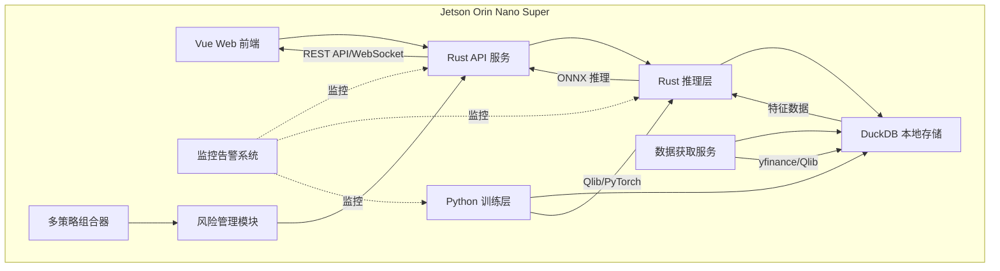

# 技术架构

## 1. 技术选型

| 层级 | 技术栈 | 选型理由 |
|------|--------|----------|
| 前端 | Vue 3 + TypeScript + Vite | 现代化 Web 界面，轻量级 |
| 接口层 | Rust (Axum) | 高性能、内存安全，适合资源受限环境 |
| 推理层 | Rust (ort) | ONNX 推理，CUDA 加速，高效利用 GPU |
| 训练层 | Python (Qlib + PyTorch) | 成熟量化框架，丰富金融算法 |
| 数据库 | DuckDB | 嵌入式，零配置，列式存储 |
| 数据源 | yfinance + Qlib | 免费开源，支持 A 股/美股 |
| 部署 | 本地部署 + Docker 可选 | 灵活部署方案 |

## 2. 系统架构

### 2.1 分层架构

| 层级 | 技术 | 职责 |
|------|------|------|
| **展示层** | Vue 3 + TypeScript | UI 展示、数据可视化、用户交互 |
| **接口层** | Rust + Axum | REST API、WebSocket、路由验证 |
| **业务层** | Rust | 推理服务、风险管理、策略管理、交易执行、监控告警 |
| **数据层** | DuckDB | 数据获取、存储、处理 |
| **训练层** | Python + Qlib | 模型训练、特征工程、回测、导出 |

## 3. 核心模块

| 模块 | 核心功能 |
|------|---------|
| **数据获取** | 多数据源、自动更新、质量验证、异常重试 |
| **特征工程** | 技术指标、因子构建、标准化、特征选择 |
| **模型训练** | GRU 模型、训练验证、超参优化、ONNX 导出 |
| **推理服务** | ONNX Runtime、GPU 加速、批量推理、缓存 |
| **风险管理** | VaR 计算、头寸管理、回撤监控、风险预警 |
| **交易执行** | 订单生成、智能拆分、成交确认、执行容错 |
| **监控告警** | 系统/性能/风险监控、多级告警 |
| **回测框架** | 历史回测、成本模拟、绩效评估、报告生成 |

## 4. 数据流

**训练流程**：数据源 → 获取 → 清洗 → 特征工程 → 训练 → ONNX 导出

**推理流程**：实时行情 → 特征计算 → 推理 → 信号生成 → 风险评估 → 交易执行

**监控流程**：系统指标 → 采集 → 异常检测 → 告警判断 → 通知发送

## 5. API 接口

**REST API**：
- `/api/market/data` - 市场数据
- `/api/strategy/backtest` - 回测
- `/api/portfolio/positions` - 持仓
- `/api/risk/metrics` - 风险指标
- `/api/orders/submit` - 提交订单

**WebSocket**：
- `/ws/market` - 实时行情
- `/ws/signals` - 交易信号
- `/ws/alerts` - 告警推送
