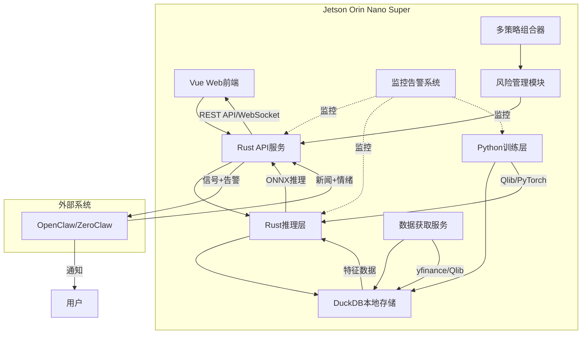

# 量化分析系统设计文档

## 1. 项目概述

### 1.1 项目简介

一个中长期的量化分析系统，具备7x24小时市场监控能力，通过AI分析提供投资建议。

**系统定位**：量化分析系统，而非自动交易系统。系统提供投资建议，用户负责最终决策和交易执行。

### 1.2 目标用户

- 个人投资者（自行使用）

### 1.3 硬件平台

- Jetson Orin Nano Super（6核 ARM Cortex-A78AE, 8GB LPDDR5, 512-core NVIDIA Ampere GPU）

### 1.4 系统角色

| 角色 | 职责 |
|------|------|
| **QuantBot** | 数据分析、信号生成、风险评估、告警触发 |
| **Claw** | 新闻抓取、情绪分析、用户通知 |
| **用户** | 接收建议、手动交易 |

---

## 2. 需求分析

### 2.1 功能需求

#### 2.1.1 核心功能

- 7x24盯盘能力
- 新闻分析（通过Claw集成）
- 提供买入卖出建议

#### 2.1.2 辅助功能

- 账户管理（模拟盘/实盘持仓记录）
- **风险管理**：VaR计算、仓位建议、最大回撤监控、止损止盈建议与告警
- **多策略组合**：权重分配、动态调整、绩效评估
- 回测框架（含交易成本、滑点、流动性成本）
- 回测报告可视化
- 策略版本管理
- **模型漂移检测**和自动重训练
- 数据源监控告警
- 模型性能监控
- 系统资源监控
- 数据自动更新机制
- **新闻数据质量验证**
- **成本估算与执行建议**
- 性能基准管理
- **Claw集成**：新闻接收、信号推送、告警推送

### 2.2 非功能需求

#### 2.2.1 性能要求

- 响应时间：< 2秒
- 推理延迟：< 100ms（单笔）
- 并发用户数：1人（单用户系统）
- 数据处理量：10万条/天 (可能)
- 模型推理吞吐：> 100次/秒（支持突发）

#### 2.2.2 安全要求

- 完全本地运行，数据不出本地
- 无外部网络依赖（除数据获取和Claw通信外）

#### 2.2.3 可用性要求

- 系统可用性：95%（考虑Jetson硬件限制）
- 恢复时间目标（RTO）：1小时
- 恢复点目标（RPO）：24小时

---

## 3. 技术架构

### 3.1 技术选型

| 层级 | 技术栈 | 选型理由 |
|------|--------|----------|
| 前端 | Vue 3 + TypeScript + Vite | 现代化Web界面，轻量级，适配本地静态文件服务 |
| 接口层 | Rust (Axum) | 高性能、内存安全的API服务，适合Jetson资源受限环境 |
| 推理层 | Rust (ort) | ONNX模型推理，支持CUDA加速，高效利用Jetson GPU |
| 训练层 | Python (Qlib + PyTorch) | 成熟的量化交易框架，丰富的金融ML算法支持 |
| 数据库 | DuckDB | 嵌入式时序数据库，零配置，列式存储优化金融数据 |
| 数据源 | yfinance (美股) + Qlib内置CN数据 (A股) | 免费开源数据源，支持代理配置 |
| 外部集成 | OpenClaw / ZeroClaw | 新闻抓取、情绪分析、用户通知 |
| 部署方案 | 本地部署为主，Docker可选 | 满足自行部署需求，同时提供容器化选项 |

### 3.2 系统架构图



### 3.3 AI模型实现方案

**核心框架**：Python/Rust混合架构

**分工明确**：

- **Python负责**：
  1. **数据源获取**: 从Yahoo Finance、Qlib等获取市场数据
  2. **特征工程**: 使用Qlib进行特征计算和数据预处理
  3. **模型训练**: 基于PyTorch的GRU模型训练
  4. **ONNX导出**: 将训练好的模型导出为ONNX格式
  
- **Rust负责**：
  1. **模型加载**: 使用ort crate加载ONNX模型
  2. **实时推理**: 高性能低延迟的模型推理
  3. **投资建议生成**: 基于预测结果生成买卖建议

**信号生成逻辑**：

- 预测收益率 > 阈值 → 买入建议
- 预测收益率 < -阈值 → 卖出建议
- 其他 → 持有/观望

**建议输出格式**：

```json
{
  "signal_id": "uuid",
  "timestamp": "2024-01-15T14:30:00Z",
  "stock_code": "AAPL",
  "action": "buy|sell|hold",
  "confidence": 0.78,
  "reason": "GRU预测上涨1.5% + 正面新闻情绪",
  "price": {
    "current": 185.50,
    "suggested_entry": 185.00,
    "stop_loss": 180.00,
    "target": 195.00
  },
  "risk": {
    "var_95": 0.015,
    "position_suggestion": 5000,
    "position_percent": 0.05
  },
  "cost_estimate": {
    "commission": 5.00,
    "slippage_estimate": 0.001,
    "total_cost_percent": 0.015
  },
  "execution_suggestion": {
    "timing": "开盘后30分钟",
    "method": "TWAP分批",
    "reason": "订单较大，建议分批执行"
  }
}
```

**Jetson Orin Nano优化策略**：

1. **模型层面**:
   - 使用量化减少模型大小
   - 优化输入维度减少计算量
   - 选择轻量级架构

2. **运行时优化**:
   - 启用硬件加速支持
   - 限制线程数减少开销
   - 内存池优化减少分配

3. **系统层面**:
   - 使用SDK提供的优化库
   - 配置性能分析工具
   - 启用高效内存访问

4. **部署优化**:
   - 预编译模型针对目标架构
   - 使用进一步优化方案 (可选)
   - 监控功耗和温度

### 3.4 风险管理框架

#### 核心风险指标

系统需要实时监控以下风险指标：

| 指标 | 定义 | 目标阈值 | 监控频率 |
|------|------|--------|--------|
| **VaR (95%)** | 95%置信度下的最大亏损 | 单日亏损 < 账户2% | 每分钟 |
| **最大回撤** | 峰值到谷底的最大跌幅 | < 20% | 每日 |
| **夏普比率** | 风险调整收益 | > 1.0 | 每日 |
| **卡玛比率** | 年收益 / 最大回撤 | > 0.5 | 每日 |
| **头寸集中度** | 单股票敞口 | < 5% | 每笔交易 |
| **总杠杆率** | 全部头寸 / 账户资产 | < 2.0 | 每笔交易 |
| **实时回撤** | 当前值与当日高点的差 | < 日均回撤150% | 每分钟 |

#### 仓位建议

使用Kelly准则计算最优头寸大小，并提供仓位建议：

- 单股敞口建议
- 总杠杆建议
- 行业敞口建议

**重要说明**：系统提供仓位建议，不执行自动调仓。

#### 止损止盈建议与告警

- **止损建议**：提供止损价格建议
- **止盈建议**：提供止盈价格建议
- **价格监控**：用户可设置监控条件，触发时告警通知
- **告警推送**：通过Claw推送告警到用户

**重要说明**：系统不执行自动止损止盈，仅提供建议和告警通知。

#### 风险预警

- **WARNING级别**（夏普比<1.0）：邮件通知，记录日志
- **ERROR级别**（实时回撤>150%）：即时推送通知
- **CRITICAL级别**（VaR突破）：紧急推送，建议用户操作

### 3.5 成本估算与执行建议

#### 成本估算

- 佣金成本：根据不同市场设置不同费率
- 滑点估算：考虑波动率和交易时段影响
- 流动性成本（Market Impact）：根据流动性等级设置不同系数
- 总成本 = 佣金 + 滑点 + 流动性成本

#### 执行时机建议

- 小单（< 日均交易1%）：直接市价执行
- 中单（1%-10%）：分3-5批，TWAP执行
- 大单（> 10%）：分10+批，VWAP执行

#### 交易前检查建议

1. **流动性检查**：订单量 ≤ 日均成交量10%
2. **买卖价差检查**：价差 > 0.5% 时警告
3. **停牌检查**：确认标的未停牌
4. **涨跌停检查**：确认标的未涨停/跌停

### 3.6 多策略组合管理

#### 权重分配方案

**推荐方案：动态权重基于性能自调整**

权重管理器配置：

- 更新频率：每日（开盘前计算权重）
- 回看周期：近20个交易日表现
- 最小权重：10%
- 最大权重：40%
- 调整阈值：变化超5%才调整

权重计算逻辑：

- 基于过去一定周期的夏普比率加权
- 应用最小/最大约束
- 重新归一化

#### 策略层级结构

```
第一层：品种类策略（股票 vs 期货 vs 期权）
  ↓
第二层：风格类策略（价值 / 成长 / 动量）
  ↓
第三层：具体策略（单一交易策略）
   └─ 每层独立分配风险预算
```

#### 绩效评估和动态调整

- **周频评估**：计算各策略的夏普比、最大回撤
- **月频调整**：根据评估结果调整权重建议
- **剔除机制**：连续3月夏普<0.5的策略暂停建议
- **重启机制**：暂停策略表现恢复后自动恢复权重建议

### 3.7 模型漂移检测和自动重训

#### 漂移类型和检测方法

| 漂移类型 | 监测方法 | 检测指标 | 触发阈值 |
|---------|---------|--------|--------|
| **数据漂移** | Kolmogorov-Smirnov检验 | KS统计量 | p-value < 0.05 |
| **特征漂移** | Wasserstein距离 | 分布变化 | > 1.5倍基线 |
| **性能漂移** | 滑动窗口性能 | 预测精度/AUC | 下降 > 15% |
| **概念漂移** | 超额收益衰减 | Alpha衰退 | 衰减 > 30% |

#### 自动重训机制

漂移检测和重训流程：

1. 检测漂移类型
2. 根据漂移程度触发不同级别的重训：
   - 轻微漂移：参数微调，保留权重
   - 中等漂移：交叉验证重训
   - 严重漂移：完全重训，重新优化
3. 验证新模型是否满足性能要求
4. 验证失败则回滚，验证通过则发布

### 3.8 监控告警系统

#### 监控维度

| 类别 | 监控指标 | 正常范围 | 告警触发 | 告警级别 |
|------|--------|--------|---------|--------|
| **策略监控** | 今日收益率 | ±2% | 连续3天负收益 | WARNING |
| | 实时夏普比 | > 1.0 | < 0.5 | ERROR |
| | 胜率 | > 45% | < 35% | ERROR |
| **风险监控** | 实时回撤 | < 日均5% | > 日均150% | CRITICAL |
| | VaR突破 | 在阈值内 | 超历史95% | CRITICAL |
| | 头寸集中度 | < 5% | > 10% | WARNING |
| **价格监控** | 止损价触发 | 未触发 | 触发 | CRITICAL |
| | 止盈价触发 | 未触发 | 触发 | INFO |
| **数据监控** | 行情延迟 | < 1秒 | > 2秒 | WARNING |
| | 数据缺失 | 0% | 任何缺失 | CRITICAL |
| | 异常值占比 | < 0.5% | > 2% | ERROR |
| **系统监控** | CPU使用率 | < 70% | > 80% | WARNING |
| | 内存使用率 | < 75% | > 85% | ERROR |
| | 磁盘可用 | > 20% | < 10% | ERROR |

#### 告警分级和响应

- **INFO**: 仅日志记录
- **WARNING**: 邮件 + 数据库记录 + Claw通知
- **ERROR**: 即时推送 + 仪表板显示 + 邮件 + Claw通知
- **CRITICAL**: 紧急推送 + Claw紧急通知 + 建议用户操作

**重要说明**：系统不执行自动平仓，仅通知用户。

### 3.9 数据质量验证

#### 市场数据校验框架

数据质量验证包含以下检查：

- 完整性检查
- 异常值检测
- 重复数据检查
- 时间顺序检查
- 价格有效性检查
- 成交量有效性检查

#### 新闻数据处理和验证

新闻处理器功能：

- 来源信誉度检查（Bloomberg、Reuters等可信源）
- 新鲜度检查（超过一定时间视为过期）
- 重复检查（TF-IDF相似度去重）
- 情绪分析置信度检查（来自Claw）

### 3.10 回测框架

#### 核心功能需求

完整回测框架包含以下验证方法：

1. 时间序列交叉验证（防止前瞻偏差）
2. Walk-Forward分析（滚动窗口回测）
3. 蒙特卡洛风险模拟
4. 压力测试（历史极端事件重放）

#### 评估指标

**收益指标**：总收益率、年化收益率、月收益波动率

**风险指标**：夏普比、索提诺比、卡玛比、最大回撤

**交易指标**：胜率、平均胜负比、盈利因子

**统计指标**：偏度、峰度、95% VaR、95% CVaR

**基准对比**：超额收益、风险敞口、信息比

### 3.11 外部系统集成 (Claw)

#### 支持的Claw类型

| 类型 | 说明 | 适用场景 |
|------|------|---------|
| **OpenClaw** | 开源版本，自部署 | 完全本地化，数据隐私要求高 |
| **ZeroClaw** | 托管服务版本 | 快速接入，无需运维 |

#### 通信协议

| 方向 | 数据类型 | 协议 |
|------|---------|------|
| Claw → QuantBot | 新闻数据 + 情绪分析 | HTTP Webhook |
| QuantBot → Claw | 交易建议 | HTTP POST |
| QuantBot → Claw | 告警通知 | HTTP POST |

#### 新闻情绪分析格式

```json
{
  "news_id": "uuid",
  "title": "...",
  "source": "Reuters",
  "published_at": "2024-01-15T10:30:00Z",
  "related_stocks": ["AAPL", "MSFT"],
  "sentiment": {
    "overall": "bullish|bearish|neutral",
    "confidence": 0.85,
    "dimensions": {
      "financial_impact": {"score": 0.7, "direction": "positive"},
      "market_sentiment": {"score": 0.6, "direction": "positive"},
      "regulatory_risk": {"score": 0.1, "direction": "neutral"}
    },
    "impact_level": "high|medium|low",
    "expected_duration": "short|medium|long"
  }
}
```

### 3.12 Jetson资源约束和优化

#### 内存管理

- 可用内存：约6-7GB
- 优化策略：
  - 模型量化，减少体积
  - 数据冷热分离（热数据内存，历史数据磁盘压缩）
  - 定期垃圾回收（内存超阈值触发清理）
  - 服务分离运行（训练/推理不并行）

#### 存储优化

- DuckDB列式压缩存储
- 时间戳和股票代码索引优化
- 保留2年历史数据（自动清理更早数据）

#### 计算优化

- 硬件加速推理
- 推理吞吐量：100-200 QPS
- 99分位延迟：< 50ms
- 动态批处理提高GPU利用率

---

## 4. 部署方案

### 4.1 本地部署（主要方案）

**部署架构**：

- Rust服务作为系统服务运行
- Vue前端作为静态文件直接访问
- DuckDB直接文件存储
- 无容器依赖，直接运行二进制文件

**启动方式**：

直接运行系统服务

### 4.2 Docker部署（可选功能）

**适用场景**：

- 快速环境搭建
- 依赖隔离
- 备份迁移

**架构特点**：

- 多阶段构建：Python训练镜像 + Rust运行时镜像
- Docker Compose编排各服务
- 数据卷挂载持久化
- Jetson ARM64原生支持

**目录结构**：

```
quant-system/
├── docker-compose.yml          # 服务编排
├── Dockerfile                 # 应用镜像构建
├── .env                       # 环境变量配置
└── data/                      # 持久化数据目录
```

---

## 5. 可行性分析

### 5.1 技术可行性

- Jetson Orin Nano Super提供足够的AI算力
- Rust+Vue+Python技术栈均为成熟开源方案
- ONNX格式确保Python/Rust模型兼容性
- DuckDB完美适配嵌入式场景

### 5.2 实施可行性

- 本地部署简化运维（无Nginx等额外依赖）
- Docker提供灵活的部署选项
- 开源数据源满足基本需求
- 模块化设计便于逐步开发

### 5.3 风险与应对

#### 核心风险识别

| 风险分类 | 风险描述 | 影响等级 | 应对措施 |
|---------|--------|--------|--------|
| **架构风险** | 风险管理框架缺失，无法评估风险 | 严重 | 实现VaR、仓位建议、止损建议 |
| | 模型漂移无检测，建议失效 | 严重 | 自动漂移检测和重训机制 |
| **资源风险** | 内存限制，8GB对完整系统紧张 | 中等 | 模型量化、冷热分离、服务分离 |
| | 推理延迟超期望 | 中等 | 批量处理、硬件加速优化 |
| **数据风险** | 数据源故障 | 严重 | 多源备份、离线缓存、降级方案 |
| | 数据质量问题 | 中等 | 数据验证框架、异常检测 |
| **系统风险** | 进程崩溃 | 严重 | 快照恢复机制、OOM监控、自动重启 |

#### 关键优先级排序

**P0（必须实现）**：

- 风险管理框架（VaR、仓位建议）
- 成本估算模型
- 模型漂移检测和自动重训
- Claw集成

**P1（强烈建议）**：

- 多策略组合机制
- 完整回测框架
- 监控告警系统
- 新闻数据验证

**P2（后续优化）**：

- 性能基准管理
- Jetson资源深度优化

### 5.4 技术实现路线图

#### Phase 1：核心系统（第1-2月）

- 完成Python数据获取和特征工程
- 训练基础GRU模型并导出ONNX
- 实现Rust API和基本推理
- 建立DuckDB数据存储

#### Phase 2：风险管理（第2-3月）

- 实现VaR计算和仓位建议
- 集成Kelly准则
- 建立监控告警框架
- 实现成本估算模型

#### Phase 3：多策略和回测（第3-4月）

- 多策略组合器
- 动态权重分配建议
- 完整回测框架
- 绩效评估

#### Phase 4：Claw集成和模型管理（第4-5月）

- Claw集成（新闻接收、信号推送、告警推送）
- 漂移检测和自动重训
- 性能基准和归因分析
- 定期报告生成

#### Phase 5：前端和优化（第5-6月）

- Vue Web界面开发
- 实时仪表板
- 性能测试和Jetson优化
- 系统集成测试

### 5.5 结论

项目技术方案总体可行。通过系统的风险管理框架、成本估算模型、模型漂移检测和自动化监控，可以构建一个可靠的量化分析系统。

**关键成功要素**：

1. **从设计阶段就融入风险控制**（不能事后弥补）
2. **完整的成本估算模型**（帮助用户了解真实成本）
3. **清晰的系统定位**（建议系统，不执行交易）
4. **持续的模型漂移监测**（保持策略有效性）
5. **充分的监控告警体系**（7x24自动监控）
6. **可靠的Claw集成**（新闻和通知的中枢）

建议按路线图分阶段推进，优先完成核心风险管理框架和Claw集成。

---

## 6. 实施检查清单

### Phase-by-Phase验收标准

| 里程碑 | 关键验收指标 | 完成标志 |
|------|-----------|--------|
| **系统运行** | 能否连续72h不崩溃 | 日志无异常停止 |
| **数据质量** | 数据缺失率 < 0.1% | 自动检测告警 |
| **推理性能** | P99延迟 < 50ms | 压测结果 |
| **风险控制** | 回撤控制 < 20% | 回测报告 |
| **模型效果** | 夏普比 > 1.0 | 统计指标 |
| **内存稳定** | 稳定运行不OOM | 监控图表 |
| **Claw集成** | 新闻/信号/告警正常收发 | 集成测试 |

### 开发代码结构建议

```
quant-system/
├── python/
│   ├── data/              # 数据获取和特征工程
│   ├── training/          # 模型训练
│   ├── backtesting/       # 回测框架
│   ├── risk_management/   # 风险管理
│   └── utils/             # 工具函数
├── rust/
│   ├── api/               # REST API服务
│   ├── inference/         # ONNX推理
│   ├── signal/            # 信号生成
│   ├── monitoring/        # 监控告警
│   ├── claw/              # Claw集成模块
│   └── data_fetcher/      # 数据获取模块
├── frontend/
│   ├── dashboard/         # 实时仪表板
│   ├── backtest_report/   # 回测报告可视化
│   └── strategy_config/   # 策略配置界面
├── config/
│   ├── risk_config.yaml   # 风险参数
│   ├── cost_config.yaml   # 成本参数
│   ├── strategy_config.yaml # 策略参数
│   └── claw.yaml          # Claw配置
├── tests/                 # 集成测试
├── docker/                # Docker配置
└── docs/                  # 技术文档
```