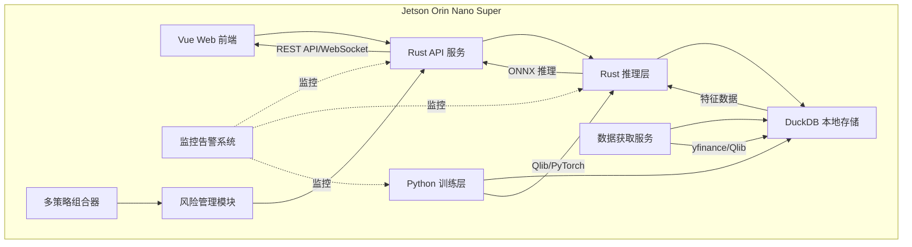

# 量化交易系统设计文档

## 1. 项目概述

### 1.1 项目简介

一个中长期的量化交易系统，具备 7x24 小时盯盘能力，可进行新闻分析并提供买卖建议。

构建完全本地化的量化交易系统，满足个人投资者对自动化交易的需求。

### 1.2 目标用户

- 个人投资者（自行使用）

### 1.3 硬件平台

- Jetson Orin Nano Super（6 核 ARM Cortex-A78AE, 8GB LPDDR5, 512-core NVIDIA Ampere GPU）

---

## 2. 需求分析

### 2.1 功能需求

#### 2.1.1 核心功能

- 7x24 盯盘能力
- 相关新闻分析
- 提供买入卖出建议

#### 2.1.2 辅助功能

- 账户管理（模拟盘/实盘）
- **风险管理**：VaR 计算、头寸大小限制、最大回撤控制、杠杆限制
- 风险控制（止损/止盈）
- **多策略组合**：权重分配、动态调整、绩效评估
- 回测框架（含交易成本、滑点、流动性成本）
- 回测报告可视化
- 策略版本管理
- **模型漂移检测**和自动重训练
- 数据源监控告警
- 模型性能监控
- 系统资源监控
- 数据自动更新机制
- **新闻数据质量验证**
- 交易执行容错和对账
- 性能基准管理

### 2.2 非功能需求

#### 2.2.1 性能要求

- 响应时间：< 2 秒
- 推理延迟：< 100ms（单笔）
- 并发用户数：1 人（单用户系统）
- 数据处理量：10 万条/天 (可能)
- 模型推理吞吐：> 100 次/秒（支持突发）

#### 2.2.2 安全要求

- 完全本地运行，数据不出本地
- 无外部网络依赖（除数据获取外）

#### 2.2.3 可用性要求

- 系统可用性：95%（考虑 Jetson 硬件限制）
- 恢复时间目标（RTO）：1 小时
- 恢复点目标（RPO）：24 小时

---

## 3. 技术架构

### 3.1 技术选型

| 层级 | 技术栈 | 选型理由 |
|------|--------|----------|
| 前端 | Vue 3 + TypeScript + Vite | 现代化 Web 界面，轻量级，适配本地静态文件服务 |
| 接口层 | Rust (Axum) | 高性能、内存安全的 API 服务，适合 Jetson 资源受限环境 |
| 推理层 | Rust (ort) | ONNX 模型推理，支持 CUDA 加速，高效利用 Jetson GPU |
| 训练层 | Python (Qlib + PyTorch) | 成熟的量化交易框架，丰富的金融 ML 算法支持 |
| 数据库 | DuckDB | 嵌入式时序数据库，零配置，列式存储优化金融数据 |
| 数据源 | yfinance (美股) + Qlib 内置 CN 数据 (A 股) | 免费开源数据源，支持代理配置 |
| 部署方案 | 本地部署为主，Docker 可选 | 满足自行部署需求，同时提供容器化选项 |

### 3.2 AI 模型实现方案

**核心框架**：Python/Rust 混合架构

**分工明确**：

- **Python 负责**：
  1. **数据源获取**: 从 Yahoo Finance、Qlib 等获取市场数据
  2. **特征工程**: 使用 Qlib 进行特征计算和数据预处理
  3. **模型训练**: 基于 PyTorch 的 GRU 模型训练
  4. **ONNX 导出**: 将训练好的模型导出为 ONNX 格式
  
- **Rust 负责**：
  1. **模型加载**: 使用 ort crate 加载 ONNX 模型
  2. **实时推理**: 高性能低延迟的模型推理
  3. **交易信号生成**: 基于预测结果生成买卖信号

**训练流程**：

1. **数据初始化**:
   - 初始化量化环境
   - 加载股票池数据

2. **模型定义**:
   - 定义 GRU 网络结构
   - 包含输入层、隐藏层和输出层

3. **训练配置**:
   - 配置优化器、损失函数
   - 设置批大小和早停机制

4. **训练执行**:
   - 执行训练循环
   - 自动保存最佳模型权重
   - 支持 GPU 加速

5. **ONNX 导出**:
   - 导出模型为 ONNX 格式
   - 支持动态批大小
   - 验证模型正确性

**推理实现**：

1. **依赖配置**:
   - 配置 ONNX Runtime 绑定
   - 配置多维数组操作库

2. **模型加载**:
   - 创建推理会话
   - 配置线程优化减少开销

3. **推理执行**:
   - 接收输入数据
   - 执行推理
   - 返回预测值

4. **信号生成**:
   - 根据预测值生成买卖信号

**Jetson Orin Nano 优化策略**：

1. **模型层面**:
   - 使用量化减少模型大小
   - 优化输入维度减少计算量
   - 选择轻量级架构

2. **运行时优化**:
   - 启用硬件加速支持
   - 限制线程数减少开销
   - 内存池优化减少分配

3. **系统层面**:
   - 使用 SDK 提供的优化库
   - 配置性能分析工具
   - 启用高效内存访问

4. **部署优化**:
   - 预编译模型针对目标架构
   - 使用进一步优化方案 (可选)
   - 监控功耗和温度

### 3.3 风险管理框架

#### 核心风险指标

系统需要实时监控以下风险指标：

| 指标 | 定义 | 目标阈值 | 监控频率 |
|------|------|--------|--------|
| **VaR (95%)** | 95% 置信度下的最大亏损 | 单日亏损 < 账户 2% | 每分钟 |
| **最大回撤** | 峰值到谷底的最大跌幅 | < 20% | 每日 |
| **夏普比率** | 风险调整收益 | > 1.0 | 每日 |
| **卡玛比率** | 年收益 / 最大回撤 | > 0.5 | 每日 |
| **头寸集中度** | 单股票敞口 | < 5% | 每笔交易 |
| **总杠杆率** | 全部头寸 / 账户资产 | < 2.0 | 每笔交易 |
| **实时回撤** | 当前值与当日高点的差 | < 日均回撤 150% | 每分钟 |

#### 头寸管理规则

使用 Kelly 准则计算最优头寸大小，并应用头寸约束：
- 单股敞口限制
- 总杠杆限制
- 行业敞口限制

#### 风险预警和应急响应

- **WARNING 级别**（夏普比 < 1.0）：邮件通知，记录日志
- **ERROR 级别**（实时回撤 > 150%）：即时推送通知，虚拟盘自动减仓
- **CRITICAL 级别**（VaR 突破）：自动平仓对冲，停止交易

### 3.4 成本模型和交易执行

#### 交易成本包含

交易成本模型包含以下组件：
- 佣金成本：根据不同市场设置不同费率
- 滑点模型：考虑波动率和交易时段影响
- 流动性成本（Market Impact）：根据流动性等级设置不同系数
- 总成本 = 佣金 + 滑点 + 流动性成本

#### 交易前预检查

1. **流动性检查**：订单量 ≤ 日均成交量 10%
2. **买卖价差检查**：价差 > 0.5% 时警告
3. **账户检查**：余额足额、无停牌
4. **权限检查**：标的支持做空/融资融券

#### 订单执行策略

- 小单（< 日均交易 1%）：直接市价成交
- 中单（1%-10%）：分 3-5 批，TWAP 执行
- 大单（> 10%）：分 10+ 批，VWAP 执行

### 3.5 多策略组合管理

#### 权重分配方案

**推荐方案：动态权重基于性能自调整**

权重管理器配置：
- 更新频率：每日（开盘前计算权重）
- 回看周期：近 20 个交易日表现
- 最小权重：10%
- 最大权重：40%
- 调整阈值：变化超 5% 才调整

权重计算逻辑：
- 基于过去一定周期的夏普比率加权
- 应用最小/最大约束
- 重新归一化

#### 策略层级结构

```
第一层：品种类策略（股票 vs 期货 vs 期权）
  ↓
第二层：风格类策略（价值 / 成长 / 动量）
  ↓
第三层：具体策略（单一交易策略）
   └─ 每层独立分配风险预算
```

#### 绩效评估和动态调整

- **周频评估**：计算各策略的夏普比、最大回撤
- **月频调整**：根据评估结果调整权重
- **剔除机制**：连续 3 月夏普 < 0.5 的策略暂停
- **重启机制**：暂停策略表现恢复后自动恢复权重

### 3.6 模型漂移检测和自动重训

#### 漂移类型和检测方法

| 漂移类型 | 监测方法 | 检测指标 | 触发阈值 |
|---------|---------|--------|--------|
| **数据漂移** | Kolmogorov-Smirnov 检验 | KS 统计量 | p-value < 0.05 |
| **特征漂移** | Wasserstein 距离 | 分布变化 | > 1.5 倍基线 |
| **性能漂移** | 滑动窗口性能 | 预测精度/AUC | 下降 > 15% |
| **概念漂移** | 超额收益衰减 | Alpha 衰退 | 衰减 > 30% |

#### 自动重训机制

漂移检测和重训流程：
1. 检测漂移类型
2. 根据漂移程度触发不同级别的重训：
   - 轻微漂移：参数微调，保留权重
   - 中等漂移：交叉验证重训
   - 严重漂移：完全重训，重新优化
3. 验证新模型是否满足性能要求
4. 验证失败则回滚，验证通过则发布

#### 重训频率和范围

| 漂移程度 | 重训数据范围 | 频率 | 验证方式 |
|---------|------------|------|--------|
| 轻微 | 最近 20 天 | 每周一 | 样本外测试 |
| 中等 | 最近 60 天 | 每日 (自动) | 交叉验证 |
| 严重 | 全量历史 | 按需 | K 折 + 时间序列 CV |

### 3.7 系统架构图



### 3.8 监控告警系统

#### 监控维度完整列表

| 类别 | 监控指标 | 正常范围 | 告警触发 | 告警级别 |
|------|--------|--------|---------|--------|
| **策略监控** | 今日收益率 | ±2% | 连续 3 天负收益 | WARNING |
| | 实时夏普比 | > 1.0 | < 0.5 | ERROR |
| | 连续亏损笔数 | < 2 | > 3 | WARNING |
| | 胜率 | > 45% | < 35% | ERROR |
| **风险监控** | 实时回撤 | < 日均 5% | > 日均 150% | CRITICAL |
| | VaR 突破 | 在阈值内 | 超历史 95% | CRITICAL |
| | 头寸集中度 | < 5% | > 10% | WARNING |
| | 实时杠杆率 | < 2.0 | > 3.0 | ERROR |
| **交易监控** | 成交延迟 | < 2 秒 | > 5 秒 | ERROR |
| | 滑点异常 | 基线 | 超预期 500bps | ERROR |
| | 委托失败率 | < 1% | > 2% | WARNING |
| | 成交确认 | 100% | 有未确认订单 | CRITICAL |
| **数据监控** | 行情延迟 | < 1 秒 | > 2 秒 | WARNING |
| | 数据缺失 | 0% | 任何缺失 | CRITICAL |
| | 重复数据占比 | < 0.02% | > 0.1% | WARNING |
| | 异常值占比 | < 0.5% | > 2% | ERROR |
| | 数据一致性 | 100% | 源间差异 > 0.5% | WARNING |
| **系统监控** | CPU 使用率 | < 70% | > 80% | WARNING |
| | 内存使用率 | < 75% | > 85% | ERROR |
| | 磁盘可用 | > 20% | < 10% | ERROR |
| | 进程健康 | 运行中 | 异常退出 | CRITICAL |
| | 网络连接 | 正常 | 超时/断开 | ERROR |

#### 告警分级和响应

告警服务定义以下级别：
- **INFO**: 仅日志记录
- **WARNING**: 邮件 + 数据库记录
- **ERROR**: 微信推送 + 仪表板显示 + 邮件
- **CRITICAL**: 即时推送 + 自动对冲/平仓 + 紧急停止

告警触发动作：
1. 记录到数据库
2. 根据级别发送邮件
3. 根据级别推送通知和更新仪表板
4. CRITICAL 级别触发紧急停止和对冲/平仓

#### 异常检测算法

- **时间序列异常**：Isolation Forest + LOF 混合检测
- **滑动窗口**：检测策略性能衰退（连续 5 日性能下降）
- **统计异常**：Z-score > 3σ 触发告警
- **梯度异常**：指标变化速率过快

### 3.9 数据质量验证

#### 市场数据校验框架

数据质量验证包含以下检查：
- 完整性检查
- 异常值检测
- 重复数据检查
- 时间顺序检查
- 价格有效性检查
- 成交量有效性检查
- 缺口有效性检查

价格有效性检查：验证单日涨跌范围，超过阈值则标记异常

成交量有效性检查：验证零成交量和异常倍数成交量

#### 新闻数据处理和验证

新闻处理器功能：
- 维护可信来源列表（如 Bloomberg、Reuters、官方公告等）
- 来源信誉度检查
- 新鲜度检查（超过一定时间视为过期）
- 重复检查
- 情绪分析置信度检查

去重功能：基于 TF-IDF 相似度的聚类去重

### 3.10 交易执行容错机制

#### 常见失败场景和容错策略

| 失败场景 | 排查原因 | 容错机制 |
|---------|--------|--------|
| **委托被拒** | 余额不足/停牌/权限 | 预检查 + 重试 3 次 |
| **成交延迟** | 网络断网/交易所繁忙 | 超时重发 + 本地队列缓冲 |
| **成交价偏离预期** | 行情变化/滑点 | 设置挂单有效期 + 止损保护 |
| **部分成交** | 流动性不足 | 订单自动拆分 + 递进式成交 |
| **成交确认丢失** | 网络中断 | 定期对账 + 重复成交保护 |
| **系统崩溃** | 进程异常/OOM | 快照恢复机制（最多 24h 数据丢失） |
| **券商 API 故障** | 第三方问题 | 多源备份 + 自动切换 |

#### 容错实现框架

订单执行容错流程：
1. 预检查订单
2. 执行订单
3. 确认订单
4. 对账

异常处理：
- 流动性不足：拆分订单重试
- 超时：指数退避重发
- 其他异常：重试后记录告警

#### 对账和状态一致性保护

定期对账服务：
- 定期与券商对账
- 比较本地订单和券商订单
- 处理状态不一致情况
- 检查未知订单

### 3.11 回测框架

#### 核心功能需求

完整回测框架包含以下验证方法：
1. 时间序列交叉验证（防止前瞻偏差）
2. Walk-Forward 分析（滚动窗口回测）
3. 蒙特卡洛风险模拟
4. 压力测试（历史极端事件重放）

#### 评估指标

系统计算以下关键指标：

**收益指标**：
- 总收益率
- 年化收益率
- 月收益波动率

**风险指标**：
- 夏普比（年化）
- 索提诺比
- 卡玛比
- 最大回撤

**交易指标**：
- 胜率
- 平均胜负比
- 盈利因子
- 最大连续亏损笔数

**统计指标**：
- 偏度
- 峰度
- 95% VaR
- 95% CVaR（期望亏损）

**基准对比**：
- 超额收益
- 风险敞口
- 信息比

#### 成本和流动性模型在回测中的应用

回测成本模型应用：
1. 佣金成本
2. 滑点成本（考虑时段、波动率）
3. 流动性成本
4. 融资融券成本（如涉及）

净回报 = 策略回报 - 总成本

### 3.12 性能基准管理

#### 基准定义

基准管理器功能：
- 定义主要基准（A 股、美股、总体）
- 归因分析：策略收益来自哪些因子（动量、价值、成长、质量等）
- 回归分析获得因子暴露和收益

#### 定期报告生成

- **日报**：实时收益率、胜率、最大回撤
- **周报**：夏普比、信息比、因子归因
- **月报**：完整绩效分析、风险统计、与基准对比
- **年报**：策略演进、参数优化、年度总结

### 3.13 Jetson 资源约束和优化

#### 内存管理

- 可用内存：约 6-7GB
- 优化策略：
  - 模型量化，减少体积
  - 数据冷热分离（热数据内存，历史数据磁盘压缩）
  - 定期垃圾回收（内存超阈值触发清理）
  - 服务分离运行（训练/推理不并行）

#### 存储优化

- DuckDB 列式压缩存储
- 时间戳和股票代码索引优化
- 保留 2 年历史数据（自动清理更早数据）

#### 计算优化

- 硬件加速推理
- 推理吞吐量：100-200 QPS
- 99 分位延迟：< 50ms
- 动态批处理提高 GPU 利用率

---

## 4. 部署方案

### 4.1 本地部署（主要方案）

**部署架构**：

- Rust 服务作为系统服务运行
- Vue 前端作为静态文件直接访问
- DuckDB 直接文件存储
- 无容器依赖，直接运行二进制文件

**启动方式**：

直接运行系统服务

### 4.2 Docker 部署（可选功能）

**适用场景**：

- 快速环境搭建
- 依赖隔离
- 备份迁移

**架构特点**：

- 多阶段构建：Python 训练镜像 + Rust 运行时镜像
- Docker Compose 编排各服务
- 数据卷挂载持久化
- Jetson ARM64 原生支持

**目录结构**：

```
quant-system/
├── docker-compose.yml          # 服务编排
├── Dockerfile                 # 应用镜像构建
├── .env                       # 环境变量配置
└── data/                      # 持久化数据目录
```

---

## 5. 可行性分析

### 5.1 技术可行性

- Jetson Orin Nano Super 提供足够的 AI 算力
- Rust+Vue+Python 技术栈均为成熟开源方案
- ONNX 格式确保 Python/Rust 模型兼容性
- DuckDB 完美适配嵌入式场景

### 5.2 实施可行性

- 本地部署简化运维（无 Nginx 等额外依赖）
- Docker 提供灵活的部署选项
- 开源数据源满足基本需求
- 模块化设计便于逐步开发

### 5.3 风险与应对

#### 核心风险识别

| 风险分类 | 风险描述 | 影响等级 | 应对措施 |
|---------|--------|--------|--------|
| **架构风险** | 风险管理框架缺失，无法控制最大亏损 | 严重 | 实现 VaR、头寸限制、Kelly 准则 |
| | 模型漂移无检测，策略逐渐失效 | 严重 | 自动漂移检测和重训机制 |
| | 交易执行容错不足，网络中断导致数据丢失 | 严重 | 对账保护、快照恢复、多源备份 |
| **资源风险** | 内存限制，8GB 对完整系统紧张 | 中等 | 模型量化、冷热分离、服务分离 |
| | 推理延迟超期望，无法及时交易 | 中等 | 批量处理、硬件加速优化、负载测试 |
| **数据风险** | 数据源故障导致无行情、无交易 | 严重 | 多源备份、离线缓存、降级方案 |
| | 数据质量问题，产生错误信号 | 中等 | 数据验证框架、异常检测 |
| | 新闻数据虚假信息误导交易 | 中等 | 来源验证、情绪置信度阈值、人工审核 |
| **系统风险** | 进程崩溃导致仓位不可控 | 严重 | 快照恢复机制、OOM 监控、自动重启 |
| | 网络断连期间交易信号丢失 | 中等 | 本地队列缓冲、重连重发机制 |
| **交易风险** | 滑点超预期，影响策略盈利 | 中等 | 回测中完整成本模型、交前流动性检查 |
| | 单股浓度过高，风险集中 | 中等 | 头寸大小限制、行业分散 |
| | 杠杆过度导致爆仓 | 严重 | Kelly 准则计算、杠杆率监控、保险止损 |

#### 关键优先级排序

**P0（必须实现）**：

- 风险管理框架（VaR、头寸限制）
- 成本模型（佣金、滑点、流动性）
- 模型漂移检测和自动重训
- 交易执行容错（对账、重试、快照）

**P1（强烈建议）**：

- 多策略组合机制
- 完整回测框架
- 监控告警系统
- 新闻数据验证

**P2（后续优化）**：

- 性能基准管理
- Jetson 资源深度优化
- 高可用部署（冗余）

### 5.4 技术实现路线图

#### Phase 1：核心系统（第 1-2 月）

- ✓ 完成 Python 数据获取和特征工程
- ✓ 训练基础 GRU 模型并导出 ONNX
- ✓ 实现 Rust API 和基本推理
- ✓ 建立 DuckDB 数据存储

#### Phase 2：风险管理（第 2-3 月）

- 实现 VaR 计算和头寸限制
- 集成 Kelly 准则
- 建立监控告警框架
- 实现成本模型和流动性检查

#### Phase 3：容错和多策略（第 3-4 月）

- 交易执行容错机制
- 对账和恢复
- 多策略组合器
- 动态权重分配

#### Phase 4：完整回测和模型管理（第 4-5 月）

- 完整回测框架
- 漂移检测和自动重训
- 性能基准和归因分析
- 定期报告生成

#### Phase 5：前端和优化（第 5-6 月）

- Vue Web 界面开发
- 实时仪表板
- 性能测试和 Jetson 优化
- 系统集成测试

### 5.5 结论

项目技术方案总体可行。通过系统的风险管理框架、完善的容错机制、模型漂移检测和自动化监控，可以构建一个相对健壮的量化交易系统。

**关键成功要素**：

1. **从设计阶段就融入风险控制**（不能事后弥补）
2. **完整的成本模型在回测中应用**（保证回测与实盘一致）
3. **强大的容错和对账机制**（Jetson 可靠性关键）
4. **持续的模型漂移监测**（保持策略有效性）
5. **充分的监控告警体系**（7x24 自动值班）

建议按路线图分阶段推进，优先完成核心风险管理框架和交易容错机制。

---

## 6. 实施检查清单

### Phase-by-Phase 验收标准

| 里程碑 | 关键验收指标 | 完成标志 |
|------|-----------|--------|
| **系统运行** | 能否连续 72h 不崩溃 | 日志无异常停止 |
| **数据质量** | 数据缺失率 < 0.1% | 自动检测告警 |
| **推理性能** | P99 延迟 < 50ms | 压测结果 |
| **交易执行** | 成交确认率 > 99.9% | 对账记录 |
| **风险控制** | 回撤控制 < 20% | 回测报告 |
| **模型效果** | 夏普比 > 1.0 | 统计指标 |
| **内存稳定** | 稳定运行不 OOM | 监控图表 |

### 开发代码结构建议

```
quant-system/
├── python/
│   ├── data/              # 数据获取和特征工程
│   ├── training/          # 模型训练
│   ├── backtesting/       # 回测框架
│   ├── risk_management/   # 风险管理
│   └── utils/             # 工具函数
├── rust/
│   ├── api/               # REST API 服务
│   ├── inference/         # ONNX 推理
│   ├── execution/         # 交易执行
│   ├── monitoring/        # 监控告警
│   ├── reconciliation/    # 对账模块
│   └── data_fetcher/      # 数据获取模块
├── frontend/
│   ├── dashboard/         # 实时仪表板
│   ├── backtest_report/   # 回测报告可视化
│   └── strategy_config/   # 策略配置界面
├── config/
│   ├── risk_config.yaml   # 风险参数
│   ├── cost_config.yaml   # 成本参数
│   └── strategy_config.yaml # 策略参数
├── tests/                 # 集成测试
├── docker/                # Docker 配置
└── docs/                  # 技术文档
```
